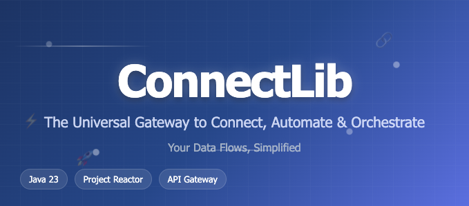

<div align="center">



<br>


</div>

Welcome to **ConnectLib**: the universal gateway to connect, automate and orchestrate your data flows!
And if you thought APIs were complicated, think again! With ConnectLib, it's like playing with Lego: simple, intuitive and powerful.
> For information, this library is not intended to be used for Minecraft, it is used professionally in a Java project.

---

```java
Stable Version: 0.3.6-STABLE
```

---

```java[build.gradle](build.gradle)
Support Lib : Java 23

Hook -----------------------|
 - Support Minecraft 1.16 - Latest Version
 - Support LangType 2.0 - Latest Version

 - Coming Soon.
```
---
## LangManager
```
 EN : Released - Version 1.3 - Latest Version
 FR : Sorti - Version 1.2 - Dernière version
 ```

---

Stay informed about the latest features and updates of ConnectLib.

- Advanced debugging system. Available soon.
[readme.md](readme.md)
---

Changelog:

```java
 - [0.1.3.9-SNAPSHOT]: Added data serialization for perfect data compatibility with HOOK.
 - [0.1.3.17-SNAPSHOT]: Removal of data serialization... Still available from the /feature/serializer branch. Useful if processes are not initialized in the same environment.
 - [0.1.9.2-STABLE]: Security patch using the getRoutes method using an enumeration class for routeName: StackOverflowError... + Creation of maps according to the desired variable type.
 - [0.2.0-STABLE]: Wow, arrival of 0.2.0 in such a short time? There were things to do on this project ;)
 - [0.2.2-STABLE]: Added log creation. 
 - [0.2.6.1-STABLE]: Patch dû à la compatibilité avec la création de log et le Hook Minecraft.
 - [0.2.6.4-STABLE]: Added asynchronous job execution, allowing you to run tasks in the background without blocking your main application thread.
 - [0.2.7.2-STABLE]: Remove implementation Project Reactor
 - [0.2.9-STABLE]: Added support query variables in routes, allowing you to pass parameters directly in the URL.
```

---

## 🌟 Why ConnectLib?

Imagine an API that doesn't just connect services, but becomes the conductor of your integrations. ConnectLib is designed to:

- **Centralize** your API connections
- **Automate** your recurring tasks
- **Secure** your data exchanges
- **Simplify** adding new connectors

---

## 🛠️ Main Features

- 🔌 **Centralized connector management**
- ⚡ **Automated job execution**
- 🧩 **Extensible and modular**
- 📊 **Detailed logs and monitoring**
- 🔒 **Built-in security**

---

## 🚦 Quick Start

1. **Clone the project**
   ```bash
   git clone https://github.com/your-username/ConnectLib.git
   cd ConnectLib
   ```
2. **Compile**
   ```bash
   ./gradlew build
   ```
3. **Run an example**
   ```bash
   java -jar YourJarFile.jar
   ```

---

## 🧑‍💻 Usage Example

Library Import
```java
repositories {
    
    maven {
        url = uri("https://sandro642.github.io/connectlib/jar")
   }
   
}

dependencies {
    
    implementation("fr.sandro642.github:ConnectLib:0.3.6-STABLE")
    
}

```

More examples HERE: [ExampleUsages.java](src/main/java/fr/sandro642/github/example/ExampleUsages.java)

---

## 📚 Project Structure

- `src/main/java/fr/sandro642/github/` : main source code
- `src/test/java/fr/sandro642/github/test/` : unit tests
- `build.gradle` : Gradle configuration

---

## 🤝 Contributing

1. Fork the repo
2. Create a branch (`feature/my-feature`)
3. Push your changes and open a PR

---

## 🧠 Evolution Ideas

- Adding connectors for new services
- Web management interface
- Plugin system

---

## 📞 Contact

For any questions or suggestions: [sandro33810@gmail.com](mailto:sandro33810@gmail.com)

---

> "ConnectLib is the freedom to connect the impossible."
